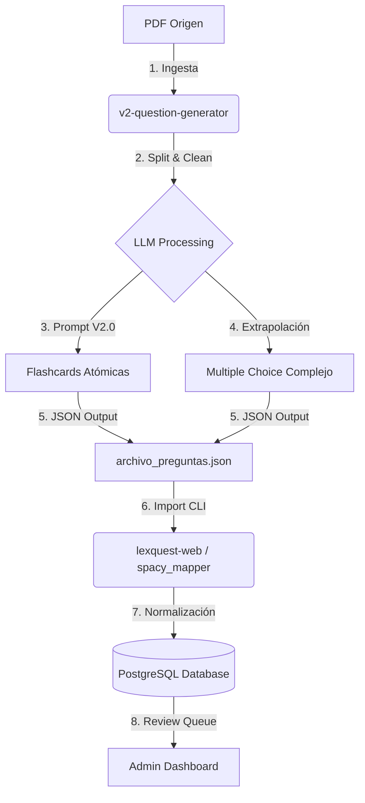

# Manual de Operación: Generación e Importación de Preguntas

Este documento explica el flujo de trabajo completo para generar contenido de alta calidad con **Generador V2** e importarlo en **LexQuest Web**.

---

## 🏗 Arquitectura del Flujo



---

## 🚀 Paso 1: Generar Preguntas

Ubicación: `/Users/rptraub/Developer/v2-question-generator`

### Configuración

Asegúrate de que estás en el entorno virtual (`venv`) y tienes configurado `config.json` con tu API Key.

### Ejecución (Ejemplo Demo)

Para generar un set de prueba basado en un documento procesado:

```bash
# Activar entorno virtual
source venv/bin/activate

# Ejecutar script de generación
python generate_demo.py
```

Esto generará archivos JSON en la carpeta `datos/procesadas/`.
*Formato:* `preguntas_{DOC_ID}_{TIMESTAMP}.json`

---

## 📦 Paso 2: Importar a LexQuest

Ubicación: `/Users/rptraub/Developer/lexquest-web`

El generador v2 produce un JSON rico que el importador web ya sabe leer.

### Comando de Importación

```bash
# Ir al directorio web
cd /Users/rptraub/Developer/lexquest-web

# Ejecutar el importador apuntando al JSON generado
python scripts/importar_preguntas_spacy.py \
    --json "/ruta/al/json/generado/en/paso_1.json" \
    --materia "Nombre de la Materia" \
    --verbose
```

### Opciones Útiles

* `--verbose`: Muestra detalle de cada pregunta importada.
* `--preview`: Simula la importación sin guardar nada en la BD (útil para verificar errores).
* `--materia "X"`: Asigna las preguntas a una materia específica (si no existe, la crea).

---

## 🛠 Solución de Problemas

### Error: "Falta anverso/reverso"

* **Causa:** El JSON no tiene la estructura `contenido_tipo` adecuada.
* **Solución:** Asegúrate de estar usando los prompts `v2.0` que generan la estructura `anverso/reverso` estándar. El importador ya soporta tanto "frente" como "anverso".

### Error: "Tipo no soportado"

* **Causa:** El generador creó un tipo de pregunta nuevo (ej. `matching`) que el web aún no implementa.
* **Solución:** Revisa `spacy_mapper.py` en la web para ver los tipos `MAPEO_TIPOS` soportados.

### Error: "Duplicado detectado"

* **Causa:** Ya importaste esa pregunta antes (mismo enunciado).
* **Acción:** El sistema la saltará automáticamente para no ensuciar la base de datos.

---

## 🧠 Estrategia de Prompts (V2.0)

* **Flashcards:** Se generan primero para asegurar "Atomicidad" (un concepto por carta).
* **Extrapolación:** El sistema usa la flashcard atómica para crear preguntas de Selección Múltiple, evitando alucinaciones con la regla de **Grounding**.
* **Grounding:** El prompt prohíbe citar bibliografía externa. Si ves citas a "Mir Puig" que no están en el texto, el modelo está alucinando; reportalo.
